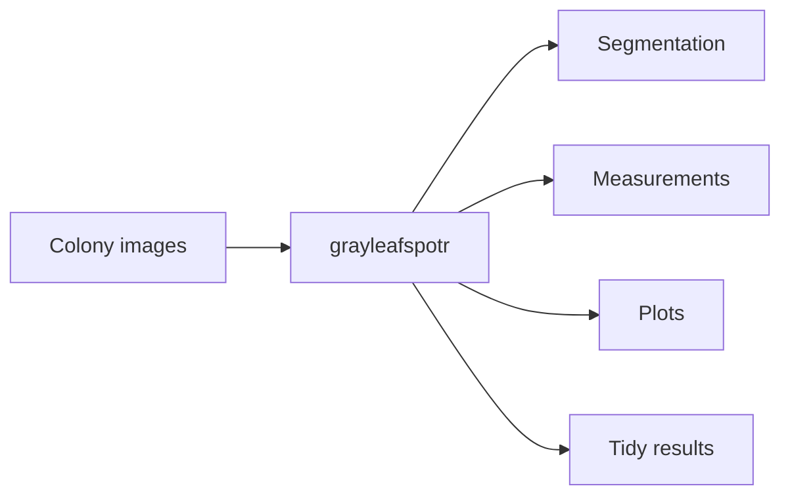
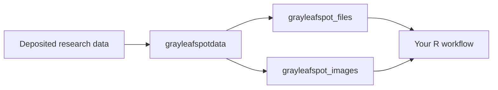
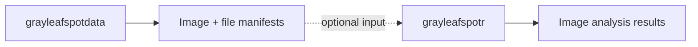
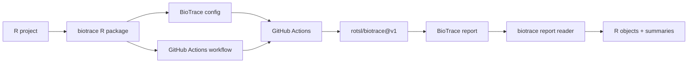
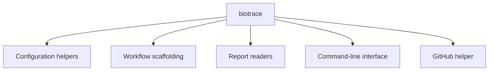
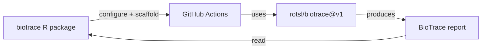
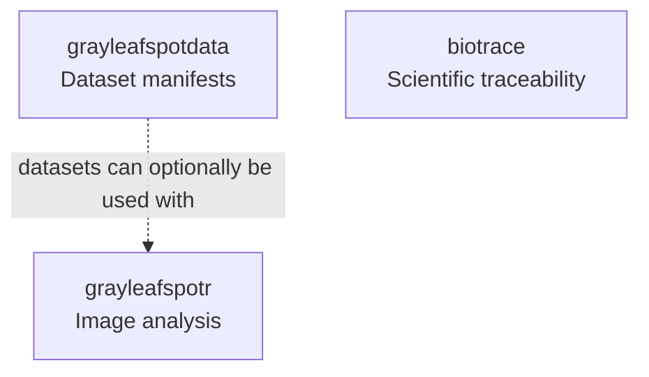
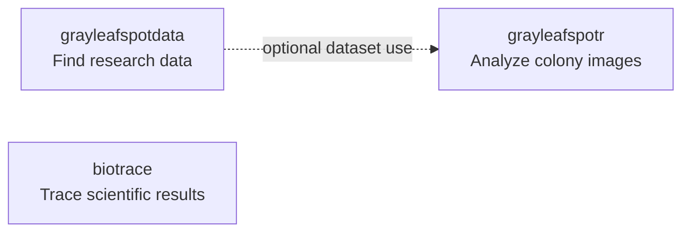

# Take package. Use package. Happy.

A tidy cave of independent R packages made by [**rotsl**](https://github.com/rotsl).

---

## Status

[](https://rotsl.r-universe.dev/packages)
[](https://rotsl.r-universe.dev/)
[](https://rotsl.r-universe.dev/articles)

---

## Packages

| Package            | What it does                                                      | R-universe                                               | Source                                              |
| ------------------ | ----------------------------------------------------------------- | -------------------------------------------------------- | --------------------------------------------------- |
| `grayleafspotr`    | Analyze gray leaf spot colony images                              | [Package](https://rotsl.r-universe.dev/grayleafspotr)    | [GitHub](https://github.com/rotsl/grayleafspotr)    |
| `grayleafspotdata` | Find gray leaf spot research files and images                     | [Package](https://rotsl.r-universe.dev/grayleafspotdata) | [GitHub](https://github.com/rotsl/grayleafspotdata) |
| `biotrace`         | Trace biological results from data and code to figures and claims | [Package](https://rotsl.r-universe.dev/biotrace)         | [GitHub](https://github.com/rotsl/biotrace-r)       |

Each package stands on its own.

`grayleafspotdata` datasets can optionally be used as inputs to `grayleafspotr`, but neither package depends on the other.

`biotrace` is separate from both gray leaf spot packages.

---

# 1. grayleafspotr

Tool for looking at gray leaf spot things in R.

[](https://rotsl.r-universe.dev/grayleafspotr)
[](https://github.com/rotsl/grayleafspotr)

`grayleafspotr` provides quantitative phenotyping tools for gray leaf spot fungal colonies grown on petri dishes.

## Use it to

* Find gray leaf spot colonies
* Segment colony images
* Measure colony things
* Make plots
* Make tidy results
* Work with time-series plate images

## Basic flow



## Links

* [grayleafspotr on R-universe](https://rotsl.r-universe.dev/grayleafspotr)
* [grayleafspotr source](https://github.com/rotsl/grayleafspotr)
* [grayleafspotr documentation](https://rotsl.github.io/grayleafspotr/)

---

# 2. grayleafspotdata

Data map for gray leaf spot image things.

[](https://rotsl.r-universe.dev/grayleafspotdata)
[](https://github.com/rotsl/grayleafspotdata)

`grayleafspotdata` provides machine-readable file and image manifests for the **S-BSST3199 Magnaporthe colony image dataset**.

Big research files stay in their original data cave.

The package gives R tidy maps showing where those files and images live without stuffing all the pictures inside the package.

## Data things

* `grayleafspot_files` — deposited file manifest
* `grayleafspot_images` — individual colony image manifest

## Good for

* Finding gray leaf spot research files
* Finding individual colony images
* Reproducible image-analysis workflows
* Plant-pathology workflows
* Using dataset information in other R workflows

## Load the data maps

```r
library(grayleafspotdata)

data("grayleafspot_files")
data("grayleafspot_images")

head(grayleafspot_files)
head(grayleafspot_images)
```

Or poke them directly:

```r
grayleafspotdata::grayleafspot_files
grayleafspotdata::grayleafspot_images
```

## Basic flow



## Optional use with grayleafspotr

`grayleafspotdata` and `grayleafspotr` are independent packages.

You can use either one without installing or using the other.

However, the image and file information provided by `grayleafspotdata` can be useful when building workflows with `grayleafspotr`.



The dotted arrow means **optional use**, not a package dependency.

## Links

* [grayleafspotdata on R-universe](https://rotsl.r-universe.dev/grayleafspotdata)
* [grayleafspotdata source](https://github.com/rotsl/grayleafspotdata)
* [All rotsl datasets](https://rotsl.r-universe.dev/datasets)

[](https://rotsl.r-universe.dev/datasets)

---

# 3. biotrace

Trace science things from data and code to figures and scientific claims.

[](https://rotsl.r-universe.dev/biotrace)
[](https://github.com/rotsl/biotrace-r)

`biotrace` is the R integration package for the **BioTrace GitHub Action**.

BioTrace traces biological results from data and code to figures and scientific claims.

The R package helps R projects configure BioTrace, create the required GitHub Actions workflow, validate configuration, and read reports produced by BioTrace.

`biotrace` is independent of `grayleafspotr` and `grayleafspotdata`.

## Use it to

* Create `.github/biotrace.yml`
* Create the BioTrace GitHub Actions workflow
* Validate BioTrace configuration
* Read BioTrace JSON reports
* Print and summarize reports in R
* Use BioTrace from the command line
* Trigger or inspect an existing BioTrace workflow on GitHub

## Quick start

```r
library(biotrace)

use_biotrace()
```

Validate a configuration file:

```r
validate_biotrace_config(".github/biotrace.yml")
```

Read a BioTrace report:

```r
report <- read_biotrace_report("biotrace-report.json")

print(report)
summary(report)
```

## How biotrace works



## Package architecture



## Important cave rule

The R package is an integration layer.



The `biotrace` R package does not vendor, modify, or locally execute the upstream TypeScript tracing engine.

## Links

* [biotrace on R-universe](https://rotsl.r-universe.dev/biotrace)
* [biotrace R source](https://github.com/rotsl/biotrace-r)
* [biotrace documentation](https://rotsl.github.io/biotrace-r/)
* [BioTrace GitHub Action](https://github.com/rotsl/biotrace)

---

# Installation

## Install all packages

All three packages can be installed together for convenience.

They do not form a required package stack.

```r
install.packages(
  c(
    "grayleafspotr",
    "grayleafspotdata",
    "biotrace"
  ),
  repos = c(
    "https://rotsl.r-universe.dev",
    "https://cloud.r-project.org"
  )
)
```

## Install one package at a time

### grayleafspotr

```r
install.packages(
  "grayleafspotr",
  repos = c(
    "https://rotsl.r-universe.dev",
    "https://cloud.r-project.org"
  )
)
```

### grayleafspotdata

```r
install.packages(
  "grayleafspotdata",
  repos = c(
    "https://rotsl.r-universe.dev",
    "https://cloud.r-project.org"
  )
)
```

### biotrace

```r
install.packages(
  "biotrace",
  repos = c(
    "https://rotsl.r-universe.dev",
    "https://cloud.r-project.org"
  )
)
```

---

# Package relationships

The packages are independent.



There is only one optional relationship:

**`grayleafspotdata` → `grayleafspotr`**

The manifests and datasets provided by `grayleafspotdata` can be used when working with `grayleafspotr`.

This does **not** mean:

* `grayleafspotr` depends on `grayleafspotdata`
* `grayleafspotdata` depends on `grayleafspotr`
* either gray leaf spot package depends on `biotrace`
* `biotrace` depends on either gray leaf spot package

Each package can be installed and used independently.

---

# Documentation

## Package wisdom

* [grayleafspotr documentation](https://rotsl.github.io/grayleafspotr/)
* [biotrace documentation](https://rotsl.github.io/biotrace-r/)

## R-universe caves

* [grayleafspotr](https://rotsl.r-universe.dev/grayleafspotr)
* [grayleafspotdata](https://rotsl.r-universe.dev/grayleafspotdata)
* [biotrace](https://rotsl.r-universe.dev/biotrace)
* [All rotsl datasets](https://rotsl.r-universe.dev/datasets)

## Source caves

* [grayleafspotr on GitHub](https://github.com/rotsl/grayleafspotr)
* [grayleafspotdata on GitHub](https://github.com/rotsl/grayleafspotdata)
* [biotrace R package on GitHub](https://github.com/rotsl/biotrace-r)
* [BioTrace GitHub Action](https://github.com/rotsl/biotrace)

---

# Gray Leaf Spot Demo Cave

Try the gray leaf spot machine here:

* [Demo cave](https://huggingface.co/spaces/rotsl/grayleafspot-segmentation-demo)
* [Model cave](https://huggingface.co/rotsl/grayleafspot-segmentation-demo)

[](https://opensource.org/licenses/Apache-2.0)
[](https://doi.org/10.57967/hf/8569)

The demo cave can:

* Take pictures
* Find gray leaf spot colonies
* Make overlay pictures
* Make plots
* Export CSV
* Export JSON
* Pack results into a ZIP bundle

---

# Cave map



**grayleafspotdata** gives tidy maps to research data.

**grayleafspotr** analyzes gray leaf spot colony images.

**biotrace** handles scientific traceability through the BioTrace GitHub Action.

Three packages.

Three separate jobs.

One optional bridge from `grayleafspotdata` to `grayleafspotr`.

Happy.
