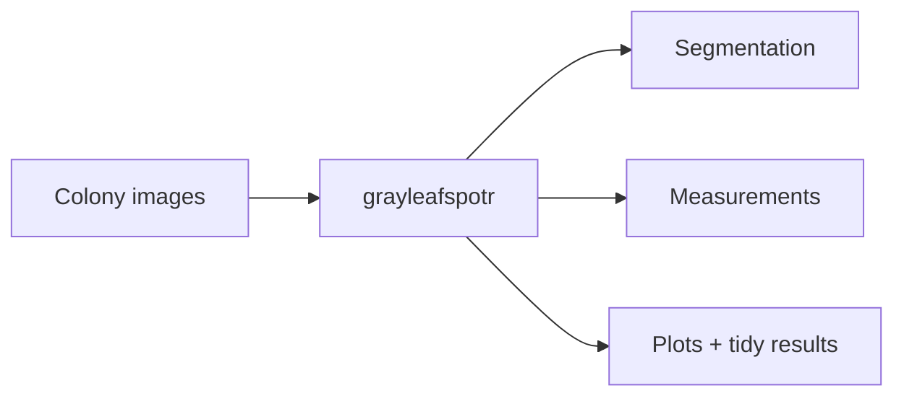
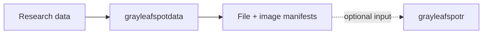
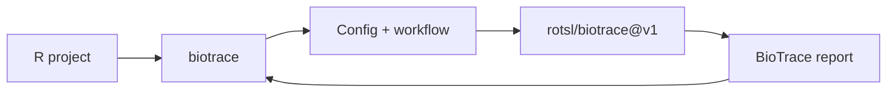
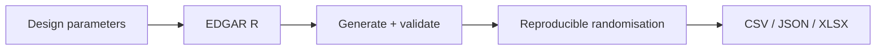
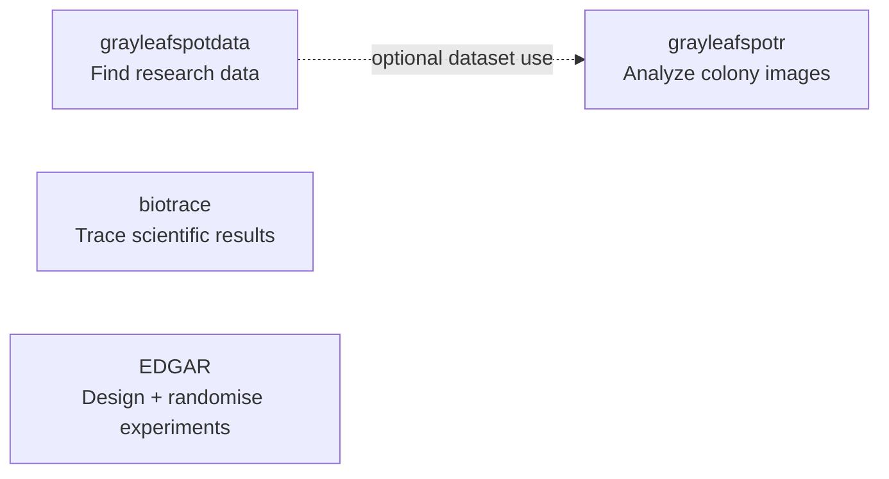

# Take package. Use package. Happy.

A tidy cave of independent R packages made by
[**Rohan R (rotsl)**](https://github.com/rotsl).

---

## Status

[](https://rotsl.r-universe.dev/packages)
[](https://rotsl.r-universe.dev/)
[](https://rotsl.r-universe.dev/articles)

---

## Packages

| Package | What it does | Get it | Source |
|---|---|---|---|
| `grayleafspotr` | Analyze gray leaf spot colony images | [rotsl](https://rotsl.r-universe.dev/grayleafspotr) · [Bioconductor universe](https://bioc.r-universe.dev/grayleafspotr) · [Bioconductor](https://bioconductor.org/packages/3.24/bioc/html/grayleafspotr.html) | [GitHub](https://github.com/rotsl/grayleafspotr) |
| `grayleafspotdata` | Find gray leaf spot research files and images | [rotsl](https://rotsl.r-universe.dev/grayleafspotdata) | [GitHub](https://github.com/rotsl/grayleafspotdata) |
| `biotrace` | Trace results from data and code to figures and claims | [rotsl](https://rotsl.r-universe.dev/biotrace) | [GitHub](https://github.com/rotsl/biotrace-r) |
| `ExperimentalDesignGeneratorandRandomiser` | Generate and randomise experimental designs (EDGAR) | [BiologyAutomation](https://biologyautomation.r-universe.dev/ExperimentalDesignGeneratorandRandomiser) · [CRAN](https://CRAN.R-project.org/package=ExperimentalDesignGeneratorandRandomiser) | [GitHub](https://github.com/biologyautomation/edgar-r) |

Each package stands alone.

One optional bridge: `grayleafspotdata` can feed file and image information into
`grayleafspotr`. No package dependency.

---

# 1. grayleafspotr

Tool for looking at gray leaf spot things in R.

[](https://rotsl.r-universe.dev/grayleafspotr)
[](https://bioc.r-universe.dev/grayleafspotr)
[](https://github.com/rotsl/grayleafspotr)
[](https://bioconductor.org/packages/3.24/bioc/html/grayleafspotr.html)
[](https://doi.org/10.18129/B9.bioc.grayleafspotr)

`grayleafspotr` analyzes gray leaf spot (*Magnaporthe oryzae*) fungal colonies
grown on petri dishes.

It segments time-lapse plate photos with a bundled SmallUNet model, measures
colony shape and texture, and makes tidy results and `ggplot2` plots.
Python things are managed through `basilisk`.

## Use it to

- Find colonies
- Segment images
- Measure colony things
- Make plots
- Make tidy results
- Work with time-series plate images


```mermaid
flowchart LR
    A["Colony images"] --> B["grayleafspotr"]
    B --> C["Segmentation"]
    B --> D["Measurements"]
    B --> E["Plots + tidy results"]
```

## Links

- [R-universe](https://rotsl.r-universe.dev/grayleafspotr)
- [Bioconductor R-universe](https://bioc.r-universe.dev/grayleafspotr)
- [Bioconductor](https://bioconductor.org/packages/3.24/bioc/html/grayleafspotr.html)
- [Documentation](https://rotsl.github.io/grayleafspotr/)
- [Source](https://github.com/rotsl/grayleafspotr)
- DOI: [10.18129/B9.bioc.grayleafspotr](https://doi.org/10.18129/B9.bioc.grayleafspotr)

---

# 2. grayleafspotdata

Data map for gray leaf spot image things.

[](https://rotsl.r-universe.dev/grayleafspotdata)
[](https://github.com/rotsl/grayleafspotdata)

`grayleafspotdata` provides machine-readable file and image manifests for the
**S-BSST3199 Magnaporthe colony image dataset**.

Big research files stay in their original data cave. Package gives tidy maps
showing where files and images live.

## Data things

- `grayleafspot_files` — deposited file manifest
- `grayleafspot_images` — individual colony image manifest

```r
library(grayleafspotdata)

data("grayleafspot_files")
data("grayleafspot_images")
```

Or poke directly:

```r
grayleafspotdata::grayleafspot_files
grayleafspotdata::grayleafspot_images
```

Can be used alone. Can also feed manifests into `grayleafspotr`.


```mermaid
flowchart LR
    A["Research data"] --> B["grayleafspotdata"]
    B --> C["File + image manifests"]
    C -. "optional input" .-> D["grayleafspotr"]
```

## Links

- [R-universe](https://rotsl.r-universe.dev/grayleafspotdata)
- [Source](https://github.com/rotsl/grayleafspotdata)
- [All rotsl datasets](https://rotsl.r-universe.dev/datasets)

---

# 3. biotrace

Trace science things from data and code to figures and claims.

[](https://rotsl.r-universe.dev/biotrace)
[](https://github.com/rotsl/biotrace-r)

`biotrace` is the R integration package for the **BioTrace GitHub Action**.

It helps R projects configure BioTrace, make the GitHub Actions workflow,
validate config, and read BioTrace reports.

## Quick start

```r
library(biotrace)

use_biotrace()
validate_biotrace_config(".github/biotrace.yml")

report <- read_biotrace_report("biotrace-report.json")
summary(report)
```


```mermaid
flowchart LR
    A["R project"] --> B["biotrace"]
    B --> C["Config + workflow"]
    C --> D["rotsl/biotrace@v1"]
    D --> E["BioTrace report"]
    E --> B
```

Cave rule: R package is integration layer. It does not vendor, modify, or
locally run the upstream TypeScript tracing engine.

## Links

- [R-universe](https://rotsl.r-universe.dev/biotrace)
- [Documentation](https://rotsl.github.io/biotrace-r/)
- [R source](https://github.com/rotsl/biotrace-r)
- [BioTrace GitHub Action](https://github.com/rotsl/biotrace)

---

# 4. ExperimentalDesignGeneratorandRandomiser

Experimental design things. Randomise them reproducibly.

[](https://biologyautomation.r-universe.dev/ExperimentalDesignGeneratorandRandomiser)
[](https://CRAN.R-project.org/package=ExperimentalDesignGeneratorandRandomiser)
[](https://github.com/biologyautomation/edgar-r)

`ExperimentalDesignGeneratorandRandomiser` is the native R implementation of
**EDGAR**, the Experimental Design Generator and Randomiser.

It ports EDGAR algorithms to native R. No Python, `reticulate`, or external
service needed at runtime.

## Use it to

- Generate reproducible experimental designs
- Randomise treatments deterministically
- Make CRD, RCBD, split-plot, two-factor, Latin-square, variable-block, and alpha designs
- Propose alpha-design structures
- Validate design parameters
- Export CSV, JSON, and XLSX


```mermaid
flowchart LR
    A["Design parameters"] --> B["EDGAR R"]
    B --> C["Generate + validate"]
    C --> D["Reproducible randomisation"]
    D --> E["CSV / JSON / XLSX"]
```

## Links

- [BiologyAutomation R-universe](https://biologyautomation.r-universe.dev/ExperimentalDesignGeneratorandRandomiser)
- [CRAN](https://CRAN.R-project.org/package=ExperimentalDesignGeneratorandRandomiser)
- [Documentation](https://rotsl.github.io/edgar/)
- [Source](https://github.com/biologyautomation/edgar-r)

---

# Installation

Install all four:

```r
install.packages(
  c(
    "grayleafspotr",
    "grayleafspotdata",
    "biotrace",
    "ExperimentalDesignGeneratorandRandomiser"
  ),
  repos = c(
    "https://bioc.r-universe.dev",
    "https://rotsl.r-universe.dev",
    "https://cloud.r-project.org"
  )
)
```

Or install one thing:

```r
install.packages(
  "grayleafspotr",
  repos = c("https://bioc.r-universe.dev", "https://cloud.r-project.org")
)

install.packages(
  "grayleafspotdata",
  repos = c("https://rotsl.r-universe.dev", "https://cloud.r-project.org")
)

install.packages(
  "biotrace",
  repos = c("https://rotsl.r-universe.dev", "https://cloud.r-project.org")
)

install.packages("ExperimentalDesignGeneratorandRandomiser")
```

---

# Cave map


```mermaid
flowchart LR
    A["grayleafspotdata<br/>Find research data"]
    B["grayleafspotr<br/>Analyze colony images"]
    C["biotrace<br/>Trace scientific results"]
    D["EDGAR<br/>Design + randomise experiments"]

    A -. "optional dataset use" .-> B
```

Four packages. Four jobs. One optional bridge.

---

# Gray Leaf Spot Demo Cave

Try gray leaf spot machine here:

- [Demo cave](https://huggingface.co/spaces/rotsl/grayleafspot-segmentation-demo)
- [Model cave](https://huggingface.co/rotsl/grayleafspot-segmentation-demo)

[](https://opensource.org/licenses/Apache-2.0)
[](https://doi.org/10.57967/hf/8569)

Demo cave takes pictures, finds colonies, makes overlays and plots, and exports
CSV, JSON, or ZIP.

Happy.
